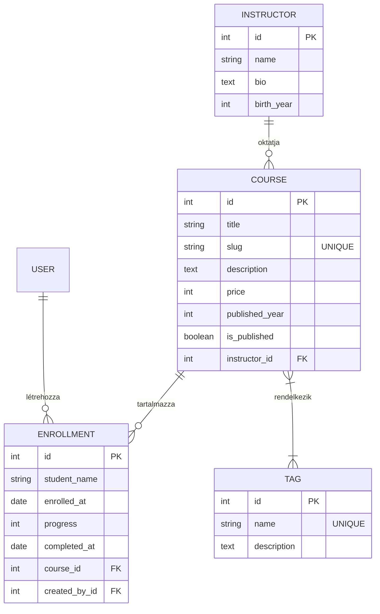

# ER diagram – Online tanfolyam

```mermaid
erDiagram
    INSTRUCTOR ||--o{ COURSE : "oktatja"
    COURSE ||--o{ ENROLLMENT : "tartalmazza"
    USER ||--o{ ENROLLMENT : "létrehozza"
    COURSE }|--|{ TAG : "rendelkezik"

    INSTRUCTOR {
        int id PK
        string name
        text bio
        int birth_year
    }
    
    TAG {
        int id PK
        string name "UNIQUE"
        text description
    }
    
    COURSE {
        int id PK
        string title
        string slug "UNIQUE"
        text description
        int price
        int published_year
        boolean is_published
        int instructor_id FK
    }
    
    ENROLLMENT {
        int id PK
        string student_name
        date enrolled_at
        int progress
        date completed_at
        int course_id FK
        int created_by_id FK
    }
```